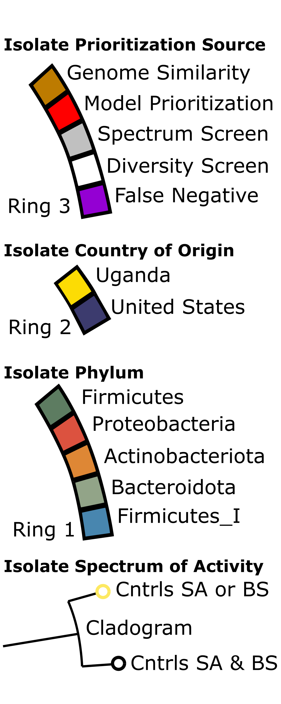
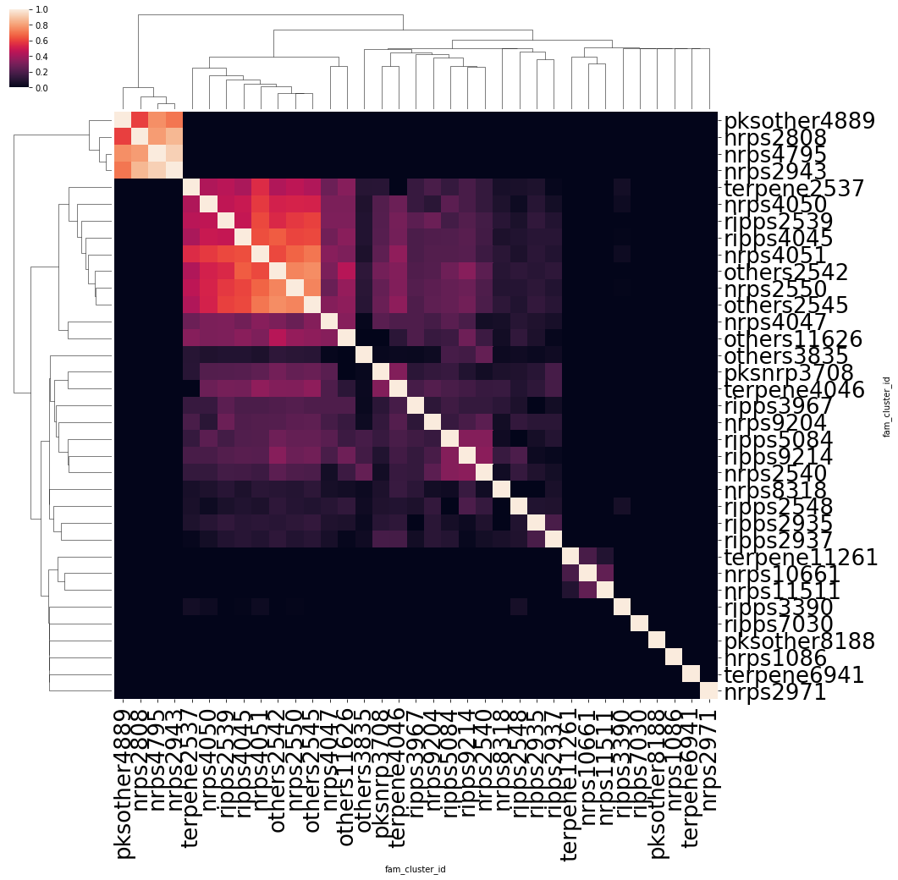
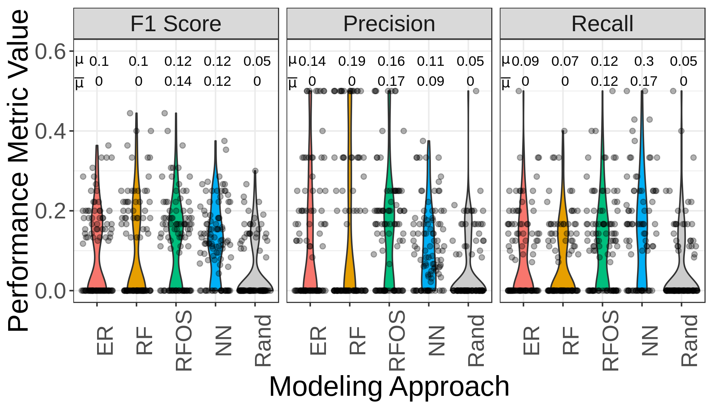
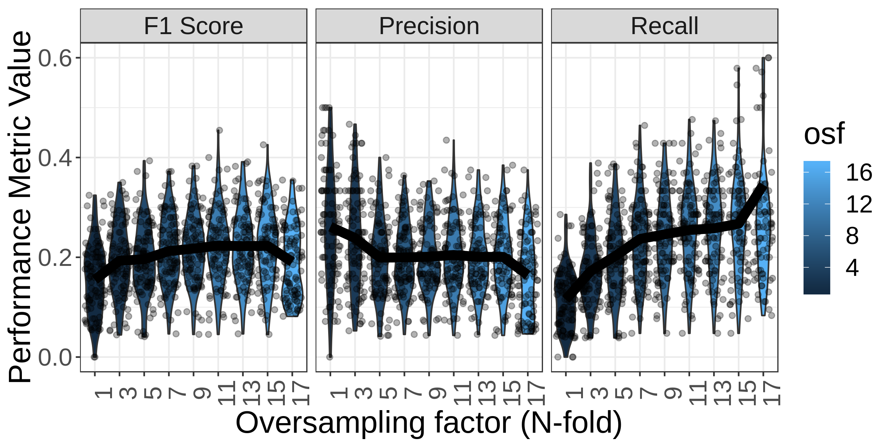
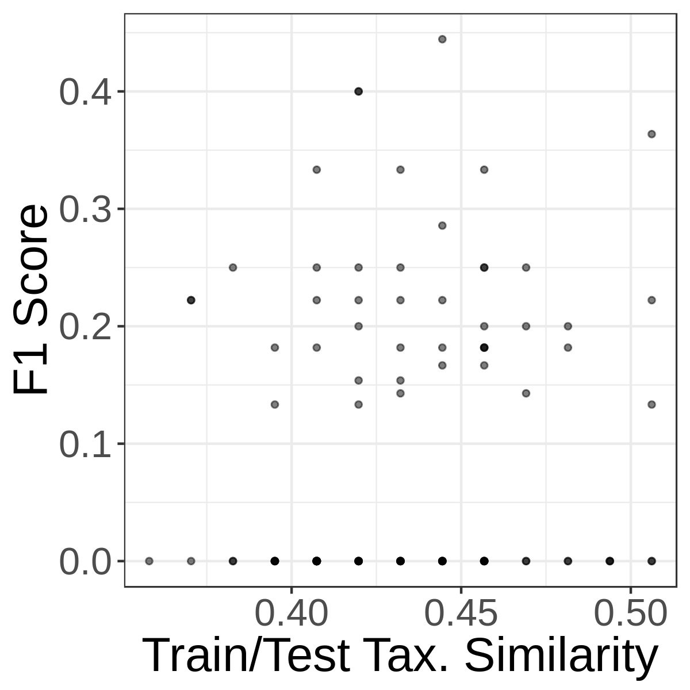
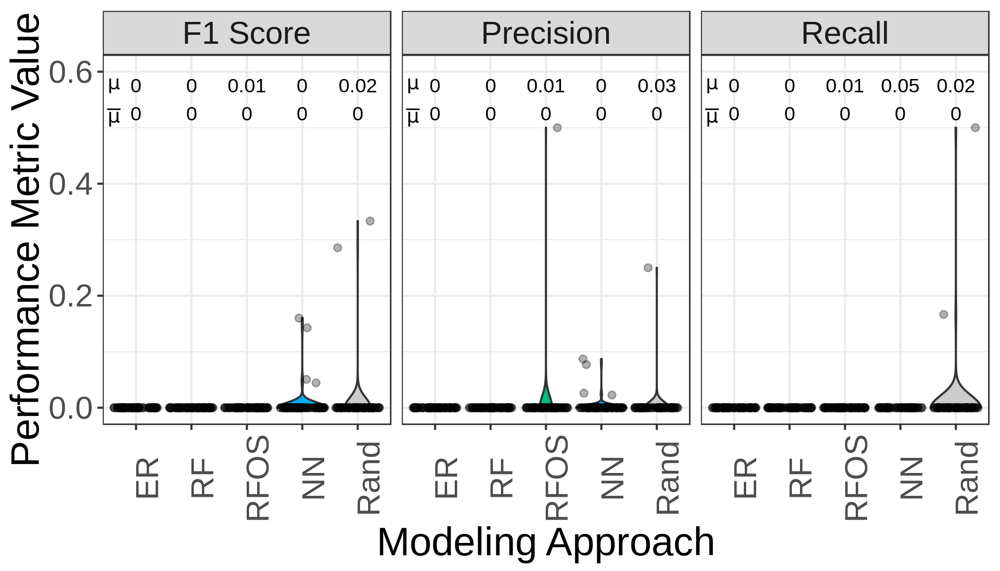
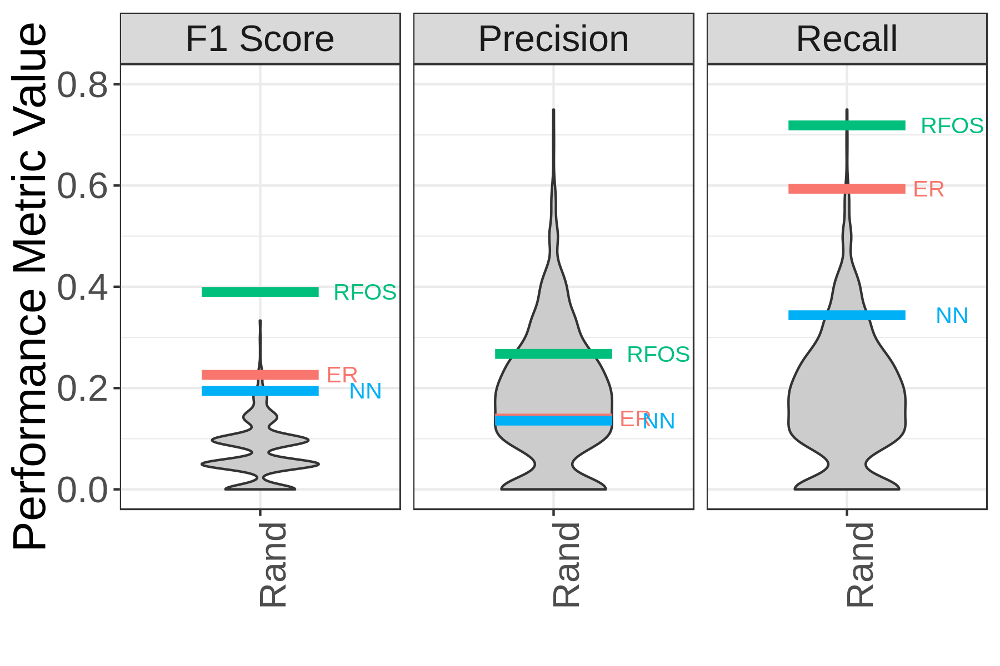

### Genomics-accelerated discovery of diverse fungicidal bacteria

This repository holds data and code necessary to reproduce the results in the manuscript 
"Genomics-accelerated discovery of diverse fungicidal bacteria". 

The "raw" data includes:
- Information about each isolate, including taxonomic assignments and screening results `isolates.tsv`
- BGCs identified in each isolate, and the results of clustering them into families `bgc_clustering_results.tsv`
- List of BGCs used to query the collection for the in vivo experiment `prioritization_exp_features.tsv`
- List of BGCs from the AgBiome collection that clustered with the query BGCs `collection_query_results.tsv`
- Taxonomic assignments for isolates in the AgBiome collection that contained hits to the query `query_taxonomy.tsv`

To reproduce figures and results, run the following command:
```
make all
```

Here's a full list of make commands:
```
 make...
 help                                        : Show this help message
 build-image                                 : Build the docker image for notebooks
 build-graphlan                              : Build the docker image for graphlan
 build-alluvial                              : Build the docker image for ggalluvial
 run-notebook                                : Run the notebook server
 stop-notebook                               : Stop the notebook server
 get-url                                     : Get the URL of the notebook server
 data/category_covariance.png                : Produce the metadata covariance figure
 data/table2.tsv                             : Produce Table 2 and related feature selection analyses
 images/model_cv.png                         : Perform cross-validation analysis to compare modeling approaches
 data/sa_rf_model_pickle                     : Train the machine learning models
 data/collection_query_pa.tsv                : Evaluate performance of ML models on validation set
 generate-cladograms                         : Produce the cladogram from the ms
 generate-cladograms                         : Produce the cladogram from the ms
 clean                                       : delete all images and derivations, keeping only original data files
 all                                         : reproduce all figures and analyses

```

|                | Figure        | Legend |
| -------------  |:-------------:|  -----:|
| Full Cladogram |  |   |
| Alluvial of all screened isolates|  |   |
| Only Actives   |  |  |
| Metadata Co-Variance |  |   |
| BGC Co-Occurrence |  |   |
| ML Crossvalidation  |  |   |
| Effect of Oversampling on RF |  |   |
| ML Performance and Taxonomic Signal |  |   |
| Excluding taxa from training set |  |   |
| Model performance in validation experiment |  |   |
| Model performance in compared to random draws |  |   |


In brief, the `make all` command runs the following notebooks:
- `summaries_and_table1.ipynb` generates Table 1 and Supplemental Figure 2
- `table2_bgc_feature_selection.ipynb` generates Table 2, Supplemental Table 1, Supplemental Figures 3 and 4.
- `model_cross_validation.ipynb` performs the ML cross-validation experiment, Figure 3 and Supplemental Figure 6
- `prioritization_exp_model_training.ipynb` generates Supplemental Figure 5, and trains the models used in the in vivo experiment
- `model_performance.ipynb` evaluates the results of the in vivo experiment, generates Figure 4.
- `figure2_cladogram.ipynb` generates the GraphLan files to produce the cladograms in Figure 2 and Supplemental Figure 1.
- `all_screened_alluvial.R` generates the alluvial plot of all screened isolates in Figure 2.

The code and data in this notebook fit together like this:

