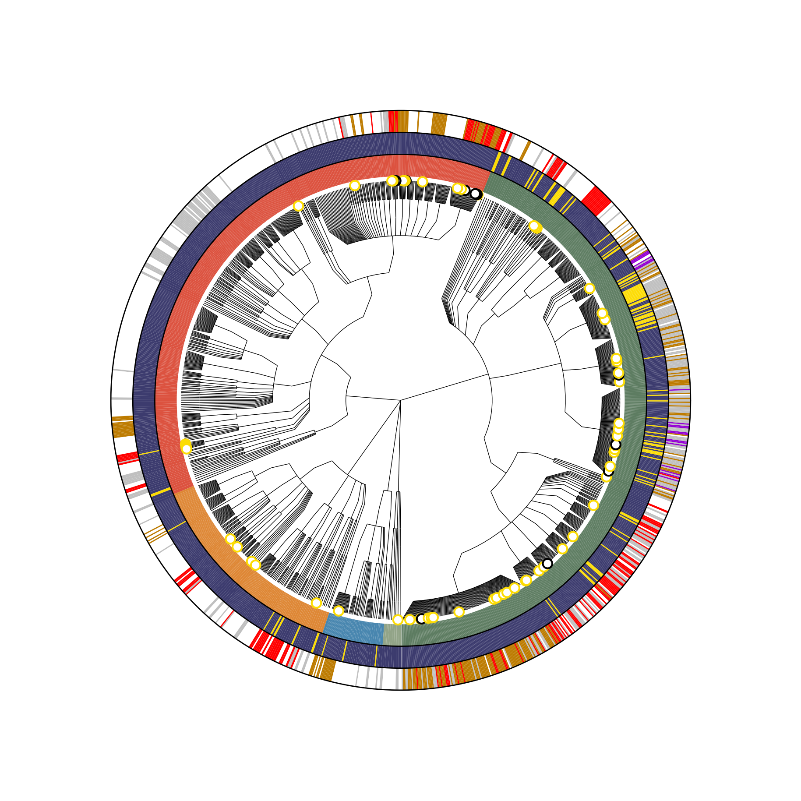
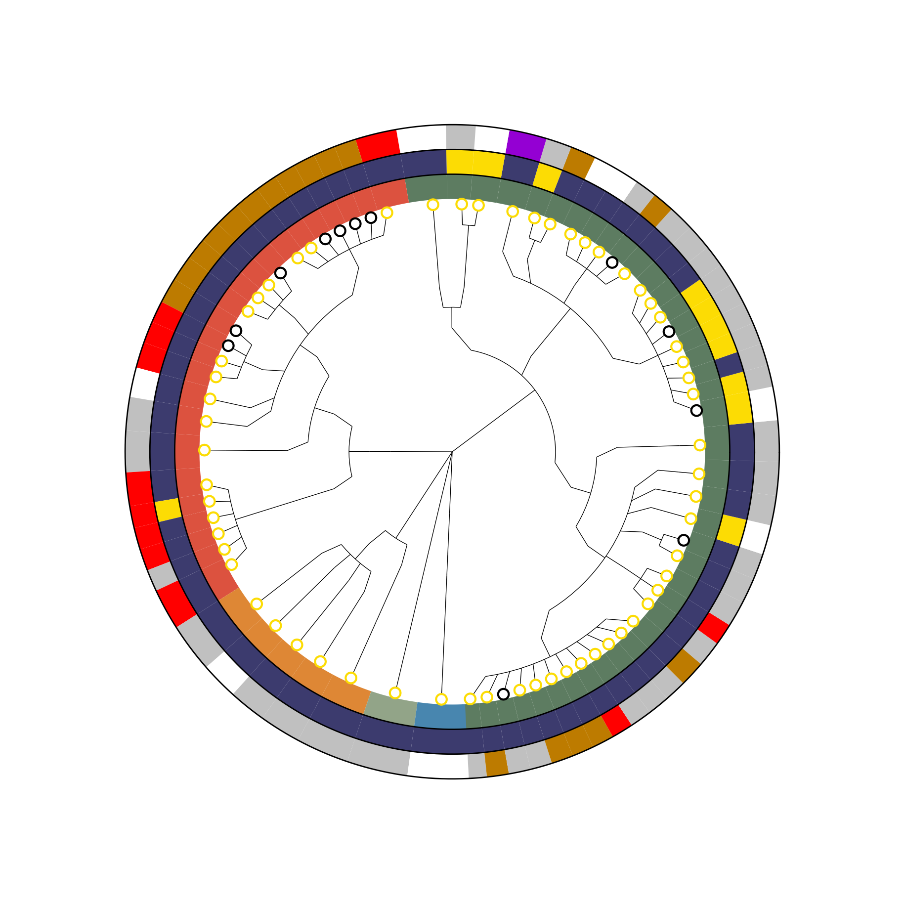
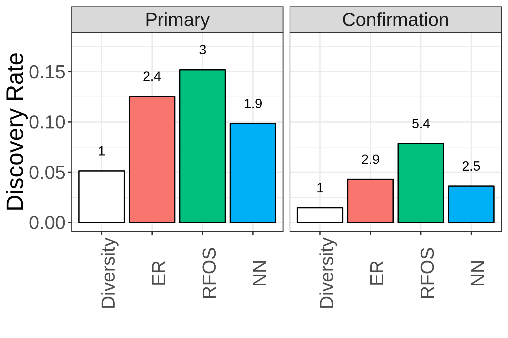
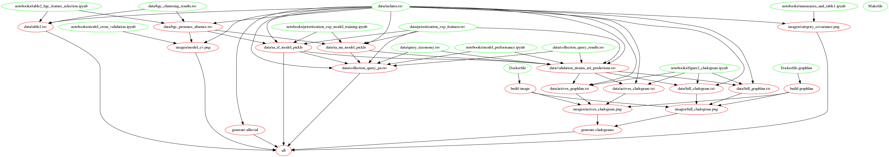

### Genomics-accelerated discovery of diverse fungicidal bacteria

To reproduce figures and results, run the following command:
```
make all
```

|                | Figure        | Legend |
| -------------  |:-------------:|  -----:|
| Full Cladogram |  |   |
| Only Actives   |  |  |
| Metadata Co-Variance |  |   |
| BGC Co-Occurrence |  |   |
| ML Crossvalidation  |  |   |
| Effect of Oversampling on RF |  |   |
| ML Performance and Taxonomic Signal |  |   |
| Excluding taxa from training set |  |   |
| Model performance in validation experiment |  |   |

The code and data in this notebook fit together like this:
